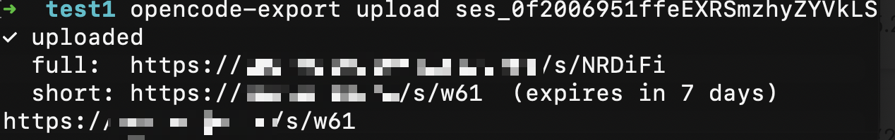
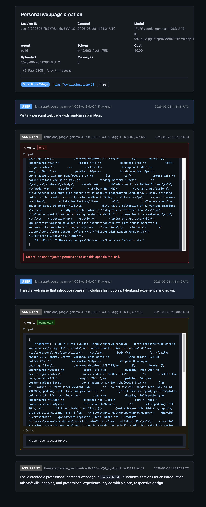

# opencode-share

Export and share [OpenCode](https://opencode.ai) sessions — because the official export is incomplete and sharing requires a paid plan.

This project has two parts:

- **`opencode-export`** — a Bash client that reads your local OpenCode SQLite database and uploads sessions to your own server.
- **`server/`** — a self-hosted PHP application that stores and renders shared sessions as clean, readable HTML pages.

## Screenshots

### Uploading a session from the CLI


### Shared session view


## Features

- Full session export — including tool calls, reasoning blocks, compaction points, and token/cost metadata
- Clean HTML rendering with syntax highlighting and dark mode support
- Paginated session view for long conversations
- **Raw JSON endpoint** — append `/raw` to any share URL (e.g. `https://share.example.com/s/AbCdEf/raw`) to get machine-readable output, ideal for feeding sessions to AI assistants
- Bearer-token authentication for upload/delete operations
- Optional [YOURLS](https://yourls.org) integration for short links with automatic expiry
- `opencode-export` CLI: list, show (Markdown), upload, list shared, delete, purge

---

## Requirements

### Server
- PHP 8.1+ with `pdo_sqlite` extension
- Nginx or Apache
- Write permission on `server/app/data/`

### Client (`opencode-export`)
- macOS or Linux
- `sqlite3`, `jq`, `curl`

---

## Server Setup

### 1. Clone and configure

```bash
git clone https://github.com/YOUR_USERNAME/opencode-share.git
cd opencode-share/server/app
cp config.example.php config.php
```

Edit `config.php`:

```php
return [
    'SHARE_TOKEN'   => 'your-strong-random-token',   // openssl rand -hex 32
    'PUBLIC_BASE_URL' => 'https://share.example.com',
    'DB_PATH'       => __DIR__ . '/data/share.db',

    // YOURLS (optional — leave empty to disable short links)
    'YOURLS_API_URL'         => '',
    'YOURLS_SIGNATURE_TOKEN' => '',
    'YOURLS_EXPIRY_DAYS'     => 7,
];
```

### 2. Set permissions

```bash
chmod 750 server/app/data
```

### 3. Nginx configuration

Point the document root to `server/public/` and route all requests through `index.php`:

```nginx
server {
    listen 443 ssl;
    server_name share.example.com;

    root /path/to/opencode-share/server/public;
    index index.php;

    location / {
        try_files $uri $uri/ /index.php$is_args$args;
    }

    location ~ \.php$ {
        fastcgi_pass unix:/run/php/php8.1-fpm.sock;
        fastcgi_param SCRIPT_FILENAME $document_root$fastcgi_script_name;
        include fastcgi_params;
    }
}
```

### 4. Apache configuration

```apache
<VirtualHost *:80>
    DocumentRoot /path/to/opencode-share/server/public
    DirectoryIndex index.php

    <Directory /path/to/opencode-share/server/public>
        AllowOverride All
        Options -Indexes
        Require all granted
    </Directory>

    # Rewrite everything through index.php
    RewriteEngine On
    RewriteCond %{REQUEST_FILENAME} !-f
    RewriteRule ^ index.php [QSA,L]
</VirtualHost>
```

---

## Client Setup

### 1. Install `opencode-export`

```bash
# Copy to a directory in your PATH
cp opencode-export ~/.local/bin/opencode-export
chmod +x ~/.local/bin/opencode-export
```

### 2. Configure

Create `~/.config/opencode-export/config`:

```bash
SHARE_URL=https://share.example.com
SHARE_TOKEN=your-strong-random-token
```

The token must match `SHARE_TOKEN` in the server's `config.php`.

---

## Usage

### List recent local sessions

```bash
opencode-export list
opencode-export list -s "keyword"   # filter by title
opencode-export list -n 50          # show more results
```

### Preview a session as Markdown

```bash
opencode-export show <session_id>
```

### Upload a session

```bash
opencode-export upload <session_id>
# Prints the share URL to stdout
```

### Manage shared sessions

```bash
opencode-export shares              # list all shared sessions
opencode-export shares -s "keyword" # filter by title
opencode-export delete <slug|url>   # delete one session
opencode-export purge               # delete ALL shared sessions
```

### Override the database path

```bash
OPENCODE_DB=/custom/path/opencode.db opencode-export list
```

### Read a session with an AI assistant

Every shared session has a raw JSON endpoint. Just append `/raw` to the share URL:

```
https://share.example.com/s/AbCdEf/raw
```

This endpoint is public (no token required) and returns the full session payload as JSON — paste the URL into your AI assistant or `curl` it directly.

---

## YOURLS Integration (Optional)

If you run a [YOURLS](https://yourls.org) instance, fill in the `YOURLS_API_URL` and `YOURLS_SIGNATURE_TOKEN` fields in `config.php`. The server will automatically generate a short link for each uploaded session and expire it after `YOURLS_EXPIRY_DAYS` days.

Leave both fields empty to disable this feature entirely — sessions are still accessible via their full URL.

---

## API Reference

| Method | Path | Auth | Description |
|--------|------|------|-------------|
| `POST` | `/api/upload` | Bearer | Upload a session (JSON body) |
| `GET` | `/api/sessions` | Bearer | List all shared sessions |
| `DELETE` | `/api/sessions` | Bearer | Delete all shared sessions |
| `DELETE` | `/api/share/:slug` | Bearer | Delete one session by slug |
| `GET` | `/s/:slug` | Public | View session as HTML |
| `GET` | `/s/:slug/raw` | Public | Get raw JSON payload |
| `GET` | `/` | Token (`?token=`) | Admin list page |

---

## Donate

If this project saved you money on a paid plan, consider buying me a coffee.

**USDT (TRC20 / Tron)**
```
TNF3Cg6TfAiGTGsLq5Nx79KATiUkHmDqjD
```

---

## License

MIT
